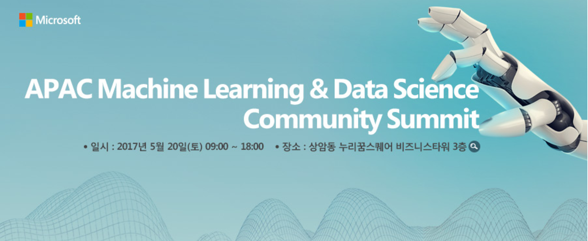

# APAC 머신러닝, 데이터 사이언스 커뮤니티 서밋 

데이터 사이언스의 현주소와 선도적인 기술들에 대해 소개하는 아시아 태평양 머신러닝 & 데이터 사이언스 서밋이 한국에서 열립니다. 보다 자세한 사항은 아래의 링크에서 확인하실 수 있습니다. 
* [APAC 머신러닝, 데이터 사이언스 커뮤니티 서밋](http://onoffmix.com/event/97444)

## 미션 요약
당신은 팀원들과 함께 이제 화성으로 떠나게 됩니다. 우주선이 제대로 잘 작동하는지에 따라 당신과 팀원들의 생사가 달려 있습니다. 무사히 지구로 귀환하기 위해서는 우주선이 양호한 상태를 유지하도록 만들어야 하는데, 예기치 못한 오류가 발생할 수도 있습니다. 이를 방지하기 위해 시스템에 기록된 수 많은 로그를 활용하여 오류를 파악해야 합니다. 지금까지는 우주선을 Azure에 연결하여 심각도에 따라 오류 로그를 파악하는 과제를 수행했습니다. 오늘 Mission Mars에서 수행하실 과제는 스마트 예측 시스템을 배포해 로그를 파악하고 심각도에 따라 표시하는 것 입니다. 이전 미션에서 생성된 로그와 심각도에 따른 표시 정보(심각도 1 ~ 3 : Low / 심각도 4 ~ 6 : High)는 이미 확보되어 있습니다.

## 미션 목표
Azure Machine Learning 솔루션을 배포해 새로 유입되는 로그의 심각도를 파악하도록 시스템을 훈련해 시스템이 입력을 추출할 뿐 아니라 심각도를 예측 및 파악할 수 있도록 해야 합니다. 로그의 심각도가 높음으로 파악될 경우에는 이를 명령 센터에 알려 가능한 해결책을 강구해야 합니다.
이 미션을 통해 간단한 R 데이터 클렌징 및 분류 알고리즘을 이해하게 될 것입니다.

## 미션 
귀하의 머신 러닝 솔루션은 시스템을 훈련할 수 있어야 하고 심각도를 1~6으로 분류할 수 있어야 합니다.

**  미션을 진행하실 때에는 미리 나눠드리는 Mission Sheet에 각 미션별 시작 시간과 종료 시간을 적어주셔야 합니다.
제일 빠르게 미션을 수행하신 분에게는 특별 선물을 증정할 예정이며 오후 5시 50분에 집계된 내용을 바탕으로 1등에게 선물을 증정하겠습니다. 1등 발표 때에 다시 Track3로 와주세요.

* [미션 1](https://github.com/APAC-EVENT/Mission-Mars/blob/master/1.Mission1.md) : 로그가 기대만큼 깨끗하지 않으므로 시스템을 훈련하기 전에 먼저 R 언어 / 모듈을 이용하고 주어진 포맷에 따라 입력을 사전 처리해야 합니다.

* [미션 2](https://github.com/APAC-EVENT/Mission-Mars/blob/master/2.Mission2.md) : 데이터를 훈련하고 예측을 도출한 뒤 프로젝트를 웹서비스 형태로 게시해야 합니다.

* [과제](https://github.com/APAC-EVENT/Mission-Mars/blob/master/3.Challenge.md): 서로 다른 분류 알고리즘을 활용한 실험으로 정확도를 높여야 합니다.
